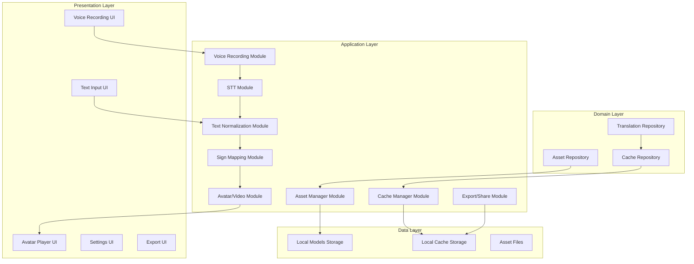

# Design Document

## Overview

This document describes the architecture and design for a Flutter-based sign language translation MVP for NGOs. The system translates voice and text input to sign language output using local AI models, with full offline functionality. The MVP focuses on core translation capabilities with local model storage, caching, and avatar/video playback.

### Key Design Principles

- **Local-First**: All models and assets are stored locally for offline use
- **Modular Architecture**: Clear separation of concerns across 8 modules
- **Performance Targets**: <3s for cached content, <8s for new content
- **Extensible**: Architecture supports future cloud integration
- **Privacy-First**: No external data transmission without explicit consent

## Architecture

### High-Level Architecture Diagram



### Layered Architecture

```
┌─────────────────────────────────────────┐
│         Presentation Layer              │
│  (UI Components, Blocs, Widgets)        │
├─────────────────────────────────────────┤
│         Application Layer               │
│  (8 Core Modules with Services)         │
├─────────────────────────────────────────┤
│         Domain Layer                    │
│  (Repositories, Use Cases, Models)      │
├─────────────────────────────────────────┤
│         Data Layer                      │
│  (Local Storage, Models, Assets)        │
└─────────────────────────────────────────┘
```

## Components and Interfaces

### 1. Voice Recording Module

**Purpose**: Capture and manage voice input

**Key Components**:
- `VoiceRecordingService`: Manages recording lifecycle
- `AudioRecorder`: Handles low-level audio capture
- `VoiceRecordingCubit`: State management for UI

**Interfaces**:
```dart
abstract class VoiceRecordingService {
  Future<void> startRecording();
  Future<String> stopRecording();
  Future<void> cancelRecording();
  bool isRecording();
  Duration getRecordingDuration();
}
```

**Dependencies**:
- `permission_handler`: For microphone access
- `record`: For audio recording

### 2. Speech-to-Text (STT) Module

**Purpose**: Convert voice recordings to text using local models

**Key Components**:
- `STTService`: Main interface for STT operations
- `LocalSTTService`: Implementation using Whisper or similar
- `STTModelManager`: Manages STT model lifecycle
- `STTResultValidator`: Validates STT output quality

**Interfaces**:
```dart
abstract class STTService {
  Future<STTResult> transcribe(String audioPath, String language);
  Future<List<STTResult>> transcribeWithConfidence(String audioPath, String language);
  bool isModelAvailable(String language);
  Future<void> downloadModel(String language);
  List<String> getAvailableLanguages();
}
```

**Dependencies**:
- `flutter_whisper`: For Whisper-based STT
- `tflite_flutter`: For TFLite model execution

### 3. Text Normalization Module

**Purpose**: Clean and standardize text for sign language mapping

**Key Components**:
- `TextNormalizationService`: Main interface
- `RAGNormalizer`: RAG-based normalization implementation
- `NormalizationCache`: Caches normalized text

**Interfaces**:
```dart
abstract class TextNormalizationService {
  Future<String> normalize(String text);
  Future<NormalizationResult> normalizeWithDetails(String text);
  Future<void> clearCache();
}
```

**Normalization Operations**:
- Remove filler words (um, uh, like)
- Remove repetitions
- Convert numbers to digits
- Standardize punctuation
- Handle contractions

### 4. Sign Mapping Module

**Purpose**: Map normalized text to sign language representations

**Key Components**:
- `SignMappingService`: Main interface
- `SignMapper`: Implementation with dictionary lookup
- `SignDatabase`: Stores sign language data
- `SignLookupCache`: Caches sign mappings

**Interfaces**:
```dart
abstract class SignMappingService {
  Future<List<SignMapping>> mapTextToSigns(String text, SignLanguageVariant variant);
  Future<SignMapping> getSignForWord(String word, SignLanguageVariant variant);
  List<SignLanguageVariant> getAvailableVariants();
  double getCoverageScore(String text, SignLanguageVariant variant);
}
```

**Data Models**:
```dart
class SignMapping {
  final String originalWord;
  final String signRepresentation;
  final double confidence;
  final bool isFallback;
}
```

### 5. Avatar/Video Playback Module

**Purpose**: Render sign language through digital avatars

**Key Components**:
- `AvatarService`: Manages avatar rendering
- `AvatarPlayer`: Handles playback controls
- `AvatarAssetManager`: Manages avatar assets

**Interfaces**:
```dart
abstract class AvatarService {
  Future<AvatarRenderResult> renderSignSequence(List<SignMapping> signs);
  Future<void> playVideo(String videoPath);
  Future<void> pauseVideo();
  Future<void> restartVideo();
  Future<void> setPlaybackSpeed(double speed);
}

abstract class AvatarPlayer {
  void play();
  void pause();
  void stop();
  void setSpeed(double speed);
  Stream<double> get playbackProgress;
}
```

### 6. Asset Manager Module

**Purpose**: Download, update, and manage local AI models and assets

**Key Components**:
- `AssetManagerService`: Main interface
- `ModelDownloader`: Handles model downloads
- `ModelManager`: Manages model lifecycle
- `ModelValidator`: Validates model integrity

**Interfaces**:
```dart
abstract class AssetManagerService {
  Future<List<ModelInfo>> getAvailableModels();
  Future<void> downloadModel(String modelId);
  Future<void> updateModel(String modelId);
  Future<void> deleteModel(String modelId);
  Future<bool> validateModel(String modelId);
  double getDownloadProgress(String modelId);
}
```

**Model Storage Strategy**:
- Models stored in `$modelsDirectory/stt`, `$modelsDirectory/normalization`, `$modelsDirectory/sign_mapping`
- Each model has checksum file for integrity verification
- Automatic redownload on corruption detection

### 7. Cache Manager Module

**Purpose**: Local caching of processed content for performance

**Key Components**:
- `CacheService`: Main interface
- `CacheManager`: Implementation
- `CacheEvictionPolicy`: Manages cache size limits

**Interfaces**:
```dart
abstract class CacheService {
  Future<void> saveCache(String key, CacheEntry entry);
  Future<CacheEntry?> getCache(String key);
  Future<void> clearCache();
  Future<int> getCacheSize();
  Future<void> evictOldEntries();
}
```

**Cache Strategy**:
- Maximum 500MB cache size
- LRU eviction policy
- Automatic cleanup when threshold reached
- Local-only storage (no cloud sync)

### 8. Export/Share Module

**Purpose**: Export and share sign language translations

**Key Components**:
- `ExportService`: Handles export operations
- `ShareManager`: Manages sharing functionality
- `ExportFormat`: Defines export formats

**Interfaces**:
```dart
abstract class ExportService {
  Future<ExportResult> exportToVideo(List<SignMapping> signs);
  Future<ExportResult> exportToImage(List<SignMapping> signs);
  Future<ExportResult> exportToLocal(String path);
}

abstract class ShareManager {
  Future<void> shareViaEmail(String filePath);
  Future<void> shareViaMessaging(String filePath);
  Future<void> shareToLocalStorage(String filePath);
}
```

## Data Models

### Translation Models

```dart
class TranslationRequest {
  final String id;
  final InputType inputType;
  final String inputContent;
  final String language;
  final SignLanguageVariant variant;
  final DateTime timestamp;
}

class TranslationResult {
  final String id;
  final TranslationRequest request;
  final String normalizedText;
  final List<SignMapping> signMappings;
  final String? avatarVideoPath;
  final TranslationStatus status;
  final DateTime timestamp;
  final double processingTimeMs;
}

enum InputType { voice, text }

enum TranslationStatus { pending, processing, completed, failed }
```

### Model Models

```dart
class ModelInfo {
  final String id;
  final ModelType type;
  final String name;
  final String version;
  final int sizeBytes;
  final ModelStatus status;
  final DateTime downloadedAt;
  final String checksum;
}

enum ModelType { stt, normalization, signMapping }

enum ModelStatus { downloading, available, updating, error }
```

### Cache Models

```dart
class CacheEntry {
  final String key;
  final String contentType;
  final String content;
  final DateTime createdAt;
  final DateTime expiresAt;
}

class CacheMetadata {
  final int totalEntries;
  final int totalSizeBytes;
  final DateTime lastAccessed;
}
```

## Data Flow

### Voice Translation Flow

```
User Input → Voice Recording → STT → Text Normalization → Sign Mapping → Avatar Rendering → Output
```

1. User starts voice recording
2. Recording is saved to local storage
3. STT service converts audio to text
4. Text normalization cleans the text
5. Sign mapper converts text to sign representations
6. Avatar service renders the sign sequence
7. Result is displayed to user

### Text Translation Flow

```
User Input → Text Normalization → Sign Mapping → Avatar Rendering → Output
```

1. User enters text
2. Text normalization cleans the text
3. Sign mapper converts text to sign representations
4. Avatar service renders the sign sequence
5. Result is displayed to user

### Cache Flow

```
Request → Check Cache → Process if Miss → Save to Cache → Return Result
```

1. Request arrives
2. Cache is checked for existing result
3. If cache miss, processing pipeline runs
4. Result is saved to cache
5. Result is returned to user

## Local Model Storage Strategy

### Storage Locations

```
app_directory/
├── models/
│   ├── stt/
│   │   ├── model_en.tflite
│   │   ├── model_ar.tflite
│   │   └── model_es.tflite
│   ├── normalization/
│   │   └── rag_model.tflite
│   └── sign_mapping/
│       ├── sign_database.db
│       └── sign_embeddings.json
├── assets/
│   └── avatar/
│       ├── sign_videos/
│       │   ├── sign_a.mp4
│       │   ├── sign_b.mp4
│       │   └── ...
│       └── avatar_config.json
└── cache/
    ├── translation_cache.db
    └── normalization_cache.db
```

### Model Download Process

1. User selects model to download
2. Model metadata is fetched from local registry
3. Model file is downloaded to temporary location
4. Checksum is verified
5. Model is moved to permanent location
6. Model registry is updated

### Model Update Process

1. System checks for available updates
2. New model is downloaded alongside existing
3. New model is validated
4. User is prompted to switch to new model
5. Old model can be retained for rollback

### Model Validation

- Checksum verification using SHA-256
- Model loading test
- Basic functionality test
- Automatic redownload on failure

## Offline-First Design Patterns

### Connectivity Detection

```dart
abstract class ConnectivityService {
  Stream<ConnectionStatus> get connectivityStream;
  Future<ConnectionStatus> checkConnectivity();
  bool get isOnline;
  bool get isOffline;
}
```

### Offline Operation Modes

1. **Fully Online**: All features available
2. **Partially Offline**: Cached content only, no new downloads
3. **Fully Offline**: All features work with local data

### Offline User Experience

- Clear offline indicator in UI
- Cached content is prioritized
- New content requests show clear messages
- Background sync when connectivity restored

### Local-Only Caching

- All cache stored locally (Hive, SQLite)
- No cloud sync in MVP
- Cache size limited to 500MB
- Automatic eviction when threshold reached

## Flutter Project Structure

```
lib/
├── main.dart                          # App entry point
├── config/
│   ├── app_config.dart                # Configuration constants
│   └── dependencies.dart              # DI container
├── core/
│   ├── constants/                     # App constants
│   ├── errors/                        # Error handling
│   ├── network/                       # Connectivity
│   └── utils/                         # Utilities
├── domain/
│   ├── models/                        # Domain models
│   ├── repositories/                  # Repository interfaces
│   └── use_cases/                     # Business logic
├── application/
│   ├── voice_recording/               # Module 1
│   ├── stt/                           # Module 2
│   ├── normalization/                 # Module 3
│   ├── sign_mapping/                  # Module 4
│   ├── avatar/                        # Module 5
│   ├── asset_manager/                 # Module 6
│   ├── cache/                         # Module 7
│   └── export/                        # Module 8
└── presentation/
    ├── bloc/                          # BLoC/Cubit state
    ├── pages/                         # Screen pages
    └── widgets/                       # Reusable widgets
```

## Technology Stack

### Core Framework

- **Flutter SDK**: Cross-platform UI framework
- **Dart**: Programming language

### State Management

- **flutter_bloc**: BLoC/Cubit pattern for state management

### Local Storage

- **hive**: Lightweight key-value database
- **hive_flutter**: Flutter integration for Hive

### Audio Processing

- **record**: Audio recording functionality
- **flutter_whisper**: Whisper-based STT
- **tflite_flutter**: TFLite model execution

### Networking

- **http**: HTTP client for model downloads
- **connectivity_plus**: Connectivity detection

### Asset Management

- **flutter_svg**: SVG rendering for avatars
- **video_player**: Video playback

### Permissions

- **permission_handler**: Permission management

### Utilities

- **crypto**: Cryptographic functions (checksums)
- **uuid**: Unique ID generation
- **logger**: Logging framework
- **get_it**: Dependency injection

## Performance Considerations

### Performance Targets

| Operation | Target Time | Measurement |
|-----------|-------------|-------------|
| Initial load | <2s | App startup to first screen |
| Cached content | <3s | From cache lookup to display |
| New content | <8s | Full processing pipeline |
| Avatar rendering | <5s | Sign sequence to video |

### Optimization Strategies

1. **Lazy Loading**: Load models only when needed
2. **Caching**: Cache all processed content
3. **Background Processing**: Use isolates for heavy operations
4. **Progress Indicators**: Show progress for long operations
5. **Memory Management**: Release assets when not in use

### Isolate Usage

- STT processing in isolate
- Text normalization in isolate
- Sign mapping in isolate
- Avatar rendering in isolate

### Memory Optimization

- Release audio files after processing
- Clear temporary files
- Limit cache size
- Use efficient data structures

## Security Considerations

### Data Encryption

- All cached data encrypted at rest using device-native encryption
- Model files encrypted during download
- Checksums verified for integrity

### Permission Handling

- Microphone permission required for voice recording
- Storage permission required for model downloads
- Clear permission request flow with explanations
- Graceful degradation if permissions denied

### Privacy Features

- No external data transmission without consent
- Local-only processing
- Anonymous usage analytics (opt-in)
- Data deletion on request

### Secure Model Storage

- Models stored in app-specific directories
- No external access to model files
- Integrity verification on load
- Automatic redownload on corruption

## Testing Strategy

### Unit Tests

- Test each service interface implementation
- Test data models serialization
- Test error handling paths
- Test edge cases and boundary conditions

### Integration Tests

- Test full translation pipeline
- Test offline mode functionality
- Test cache operations
- Test model download and validation

### Performance Tests

- Measure initial load time
- Measure cached content retrieval
- Measure new content processing time
- Measure memory usage

### Accessibility Tests

- Screen reader compatibility
- High contrast mode
- WCAG 2.1 Level AA compliance

## Error Handling

### Error Categories

1. **User Errors**: Permission denied, invalid input
2. **System Errors**: Model not found, storage full
3. **Network Errors**: Download failed, connectivity lost
4. **Processing Errors**: STT failed, normalization error

### Error Recovery

- Clear error messages
- Retry options where applicable
- Graceful degradation
- Automatic recovery where possible

## Future Enhancements

### Phase 2 Features

- Cloud sync for translation history
- Multi-user support
- Advanced analytics
- Real-time collaboration

### Architecture for Future

- Clear separation between local and cloud services
- Interface-based design for easy replacement
- Configuration flags for feature toggling
- Modular design for optional features
