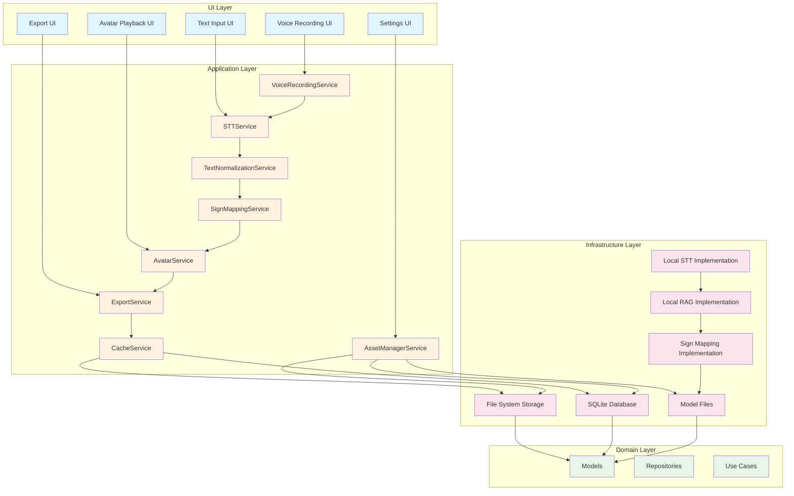
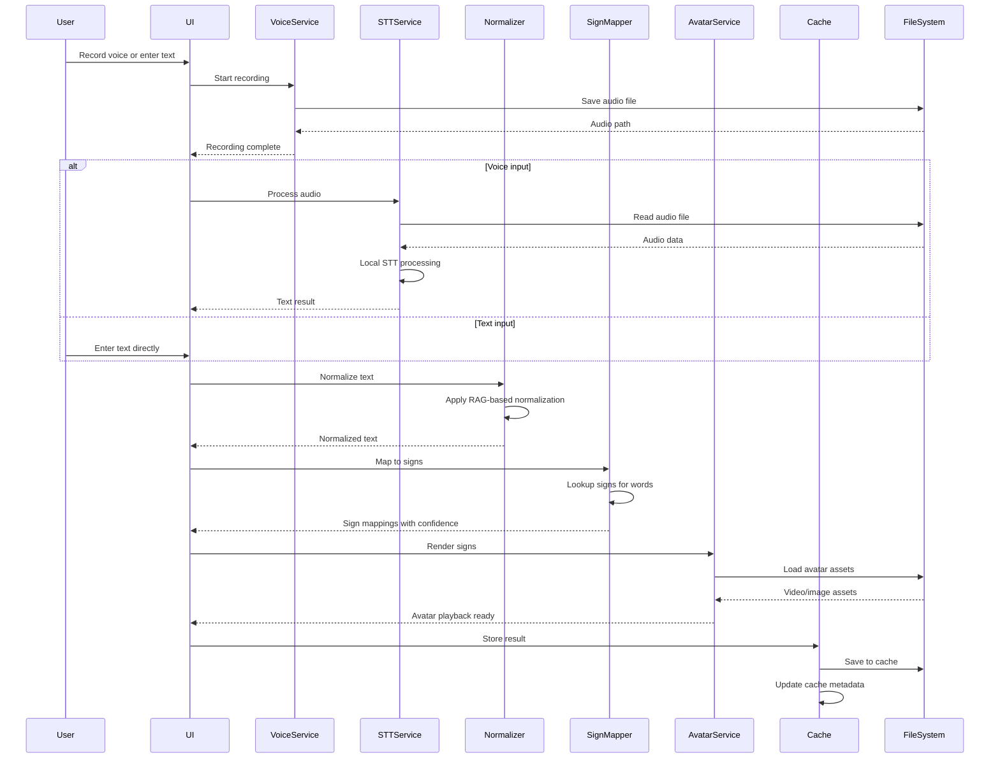
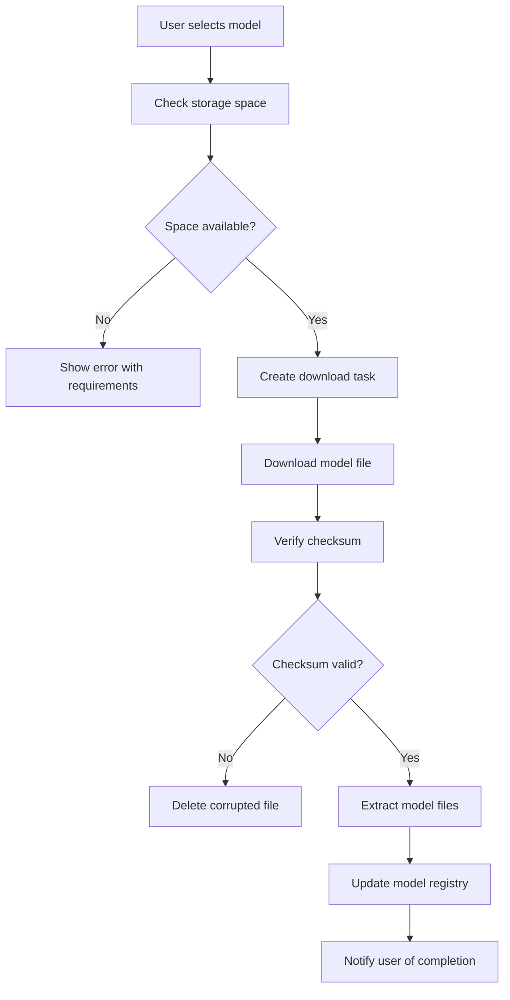

# Design Document

## Overview

This document outlines the architecture and design for a Flutter-based sign language translation MVP for NGOs. The system translates voice and text input to sign language output using local AI models, with offline-first design as a core principle.

**Key Design Principles:**
- **Local-First**: All models and processing happen on-device
- **Offline-First**: Core functionality works without internet connectivity
- **Performance-Driven**: <3s for cached content, <8s for new content
- **Privacy-First**: No data transmission without explicit consent
- **Modular**: Clean separation of concerns for maintainability

**Architecture Pattern**: Clean Architecture with layered dependencies (Domain → Application → Infrastructure → UI)

## Architecture



### Component Interaction Flow



## Components and Interfaces

### 1. Voice Recording Module

**Purpose**: Capture and manage voice recordings

**Key Classes**:
- `VoiceRecorder`: Main controller for recording lifecycle
- `AudioRecorder`: Platform-specific audio recording implementation
- `AudioValidator`: Validates recording duration and quality

**Interfaces**:
```dart
abstract class VoiceRecordingService {
  Future<bool> initialize();
  Future<void> startRecording();
  Future<String?> stopRecording();
  Future<void> cancelRecording();
  bool isRecording();
  double getRecordingDuration();
  AudioRecordingStatus get status;
}
```

**Dependencies**:
- `path_provider`: For device storage paths
- `record`: Audio recording package
- `permission_handler`: For microphone permissions

### 2. STT Processing Module (Local)

**Purpose**: Convert voice recordings to text using local models

**Key Classes**:
- `LocalSTTService`: Main STT service implementation
- `STTModelManager`: Manages STT model files and versions
- `STTResultValidator`: Validates and highlights low-confidence segments

**Interfaces**:
```dart
abstract class STTService {
  Future<STTResult> processAudio(String audioPath, String language);
  Future<List<String>> getSupportedLanguages();
  double getConfidenceThreshold();
}

class STTResult {
  final String text;
  final double confidence;
  final List<STTSegment> segments;
  final bool isLowConfidence;
}

class STTSegment {
  final String text;
  final double confidence;
  final int startTime;
  final int endTime;
}
```

**Dependencies**:
- `flutter_whisper`: Local Whisper model inference
- `tflite_flutter`: TensorFlow Lite for model execution

### 3. Text Normalization Module (Local RAG)

**Purpose**: Clean and standardize text for sign language mapping

**Key Classes**:
- `TextNormalizer`: Main normalization service
- `RAGNormalizer`: RAG-based normalization implementation
- `NormalizationCache`: Caches normalization results

**Interfaces**:
```dart
abstract class TextNormalizationService {
  Future<NormalizedText> normalize(String text);
  Future<void> updateVocabulary(List<String> newWords);
  List<String> getVocabulary();
}

class NormalizedText {
  final String text;
  final List<NormalizationChange> changes;
  final bool wasModified;
}

class NormalizationChange {
  final String original;
  final String normalized;
  final NormalizationType type;
}
```

**Dependencies**:
- `sqlite` or `hive`: For local vocabulary storage
- Custom RAG implementation using local embeddings

### 4. Sign Mapping Module

**Purpose**: Map normalized text to sign language representations

**Key Classes**:
- `SignMapper`: Main sign mapping service
- `SignDatabase`: Local database of sign mappings
- `SignLookupCache`: Caches sign lookups for performance

**Interfaces**:
```dart
abstract class SignMappingService {
  Future<List<SignMapping>> mapTextToSigns(String text, SignLanguageVariant variant);
  Future<SignMapping?> getSignForWord(String word, SignLanguageVariant variant);
  double getCoveragePercentage(SignLanguageVariant variant);
}

class SignMapping {
  final String word;
  final String? signId;
  final double confidence;
  final SignType signType;
  final List<String> alternatives;
}

enum SignType { video, image, gesture_description }
```

**Dependencies**:
- `hive` or `sqlite`: For local sign database
- Custom sign mapping logic

### 5. Avatar/Video Playback Module

**Purpose**: Render sign language sequences via avatar

**Key Classes**:
- `AvatarService`: Main avatar rendering service
- `AvatarPlayer`: Manages avatar playback
- `AvatarAssetManager`: Manages avatar assets (videos/images)

**Interfaces**:
```dart
abstract class AvatarService {
  Future<AvatarRenderResult> renderSigns(List<SignMapping> signs);
  Future<void> playAvatar(AvatarRenderResult result);
  Future<void> pauseAvatar();
  Future<void> restartAvatar();
  Future<void> setPlaybackSpeed(double speed);
}

class AvatarRenderResult {
  final List<AvatarSegment> segments;
  final Duration totalDuration;
  final bool isComplete;
}

class AvatarSegment {
  final String signId;
  final String assetPath;
  final Duration duration;
  final AvatarSegmentType type;
}
```

**Dependencies**:
- `video_player`: For video playback
- `flutter_svg`: For SVG assets
- Custom avatar rendering logic

### 6. Asset Manager (Model Downloads/Updates)

**Purpose**: Download, update, and manage local AI models

**Key Classes**:
- `AssetManager`: Main asset management service
- `ModelDownloader`: Handles model downloads
- `ModelValidator`: Validates model integrity with checksums
- `ModelManager`: Manages model versions and selection

**Interfaces**:
```dart
abstract class AssetManagerService {
  Future<List<ModelInfo>> getAvailableModels();
  Future<ModelDownloadResult> downloadModel(String modelId);
  Future<void> updateModel(String modelId);
  Future<void> deleteModel(String modelId);
  Future<bool> verifyModel(String modelId);
  ModelInfo? getModel(String modelId);
  Future<double> getDownloadProgress(String modelId);
}

class ModelInfo {
  final String id;
  final String name;
  final String description;
  final double size;
  final double installedSize;
  final ModelStatus status;
  final String checksum;
  final List<String> supportedLanguages;
  final DateTime? lastUpdated;
}

enum ModelStatus { not_installed, downloading, installed, updating, error }
```

**Dependencies**:
- `http`: For downloading models
- `crypto`: For checksum verification
- `path_provider`: For storage management

### 7. Cache Manager (Local-Only)

**Purpose**: Cache processed content for offline use and performance

**Key Classes**:
- `CacheManager`: Main cache management service
- `CacheEntry`: Represents a cached item
- `CacheEvictionPolicy`: Manages cache size limits

**Interfaces**:
```dart
abstract class CacheService {
  Future<CacheEntry?> getCacheEntry(String cacheKey);
  Future<void> saveCacheEntry(CacheEntry entry);
  Future<void> clearCache();
  Future<void> clearOldEntries(Duration maxAge);
  Future<double> getCacheSize();
  Future<bool> isCacheOverLimit();
}

class CacheEntry {
  final String cacheKey;
  final String inputType;
  final String inputContent;
  final String outputType;
  final String outputContent;
  final DateTime createdAt;
  final DateTime? updatedAt;
  final int accessCount;
}
```

**Dependencies**:
- `hive` or `sqlite`: For local caching
- `path_provider`: For file-based cache

### 8. Export/Share Module

**Purpose**: Export and share sign language translations

**Key Classes**:
- `ExportService`: Main export service
- `ExportFormat`: Defines export formats
- `ShareManager`: Manages sharing functionality

**Interfaces**:
```dart
abstract class ExportService {
  Future<ExportResult> exportToVideo(List<SignMapping> signs, String outputPath);
  Future<ExportResult> exportToImage(List<SignMapping> signs, String outputPath);
  Future<ExportResult> exportToLink(List<SignMapping> signs);
}

class ExportResult {
  final String outputPath;
  final ExportFormat format;
  final Duration? expirationTime;
  final bool isLocal;
}

enum ExportFormat { video, image, link }
```

**Dependencies**:
- `video_editor` or custom implementation: For video export
- `share_plus`: For sharing functionality
- `path_provider`: For file paths

## Data Models

### Core Domain Models

```dart
class TranslationRequest {
  final String id;
  final InputType inputType;
  final String inputContent;
  final String language;
  final SignLanguageVariant signVariant;
  final DateTime createdAt;
  final TranslationStatus status;
  final String? cacheKey;
}

class TranslationResult {
  final String id;
  final String requestId;
  final String text;
  final String normalizedText;
  final List<SignMapping> signMappings;
  final AvatarRenderResult avatarResult;
  final DateTime createdAt;
  final Duration processingTime;
}

class UserSettings {
  final SignLanguageVariant signVariant;
  final String sttLanguage;
  final bool enableAnalytics;
  final bool enableCache;
  final int cacheRetentionDays;
  final AvatarAppearance avatarAppearance;
  final bool highContrastMode;
  final bool screenReaderEnabled;
}

class ModelInfo {
  final String id;
  final String name;
  final ModelType type;
  final double size;
  final double installedSize;
  final ModelStatus status;
  final String checksum;
  final List<String> supportedLanguages;
  final DateTime? lastUpdated;
}

class UsageStats {
  final int sttCalls;
  final int normalizationCalls;
  final int signMappingCalls;
  final int avatarRenderCalls;
  final DateTime lastReset;
  final DateTime? nextReset;
}
```

### Data Flow

```
User Input (Voice/Text)
    ↓
Voice Recording (if voice)
    ↓
Audio File → STT Service → Text
    ↓
Text → Text Normalizer → Normalized Text
    ↓
Normalized Text → Sign Mapper → Sign Mappings
    ↓
Sign Mappings → Avatar Service → Avatar Result
    ↓
Avatar Result → Export Service → Exported Content
    ↓
All Results → Cache Service → Local Storage
```

## Local Model Storage Strategy

### Storage Locations

```
App Directory/
├── models/
│   ├── stt/
│   │   ├── model_v1/
│   │   │   ├── model.tflite
│   │   │   ├── config.json
│   │   │   └── checksum.txt
│   │   └── model_v2/
│   ├── normalization/
│   │   ├── vocabulary.db
│   │   └── embeddings/
│   └── sign_mapping/
│       ├── signs.db
│       └── assets/
│           ├── videos/
│           └── images/
├── cache/
│   ├── entries/
│   └── metadata.db
└── assets/
    ├── avatar/
    │   ├── videos/
    │   └── images/
    └── ui/
```

### Model Download Flow



### Model Versioning

- Models use semantic versioning (v1.0.0)
- Each model has a `config.json` with version info
- Old models are retained for backward compatibility
- Users can select which version to use

## Offline-First Design Patterns

### Connectivity Detection

```dart
class ConnectivityService {
  Stream<ConnectionStatus> get statusStream;
  Future<ConnectionStatus> checkConnection();
  bool get isOnline;
  bool get isOffline;
}
```

### Offline Operation Modes

1. **Fully Online**: All features available
2. **Partially Offline**: Some cached features available
3. **Fully Offline**: Only cached features available

### Cache-First Strategy

```dart
Future<T> getData<T>(String key, Future<T> Function() fetchRemote) async {
  // 1. Check cache first
  final cached = await cacheService.getCacheEntry(key);
  if (cached != null) {
    return parse<T>(cached.outputContent);
  }
  
  // 2. Fetch remote if online
  if (connectivityService.isOnline) {
    final remote = await fetchRemote();
    await cacheService.saveCacheEntry(
      CacheEntry(key: key, outputContent: serialize(remote)),
    );
    return remote;
  }
  
  // 3. Return error if offline and not cached
  throw OfflineException('No cached data available');
}
```

### Sync Queue for Offline Changes

```dart
class SyncQueue {
  final List<SyncOperation> pendingOperations;
  
  Future<void> enqueue(SyncOperation operation);
  Future<void> processQueue();
  Future<int> getPendingCount();
}
```

## Flutter Project Structure

```
lib/
├── main.dart
├── config/
│   ├── app_config.dart
│   └── dependencies.dart
├── core/
│   ├── constants/
│   │   ├── app_constants.dart
│   │   └── error_messages.dart
│   ├── errors/
│   │   ├── exceptions.dart
│   │   └── failures.dart
│   ├── network/
│   │   ├── connectivity_service.dart
│   │   └── network_info.dart
│   └── utils/
│       ├── logger.dart
│       └── validators.dart
├── domain/
│   ├── models/
│   │   ├── translation_models.dart
│   │   ├── user_models.dart
│   │   └── model_models.dart
│   ├── repositories/
│   │   ├── translation_repository.dart
│   │   ├── asset_repository.dart
│   │   └── cache_repository.dart
│   └── use_cases/
│       ├── translation/
│       │   ├── translate_voice.dart
│       │   ├── translate_text.dart
│       │   └── get_translation_history.dart
│       ├── asset/
│       │   ├── download_model.dart
│       │   ├── update_model.dart
│       │   └── get_available_models.dart
│       └── cache/
│           ├── save_cache.dart
│           ├── get_cache.dart
│           └── clear_cache.dart
├── application/
│   ├── voice_recording/
│   │   ├── voice_recorder.dart
│   │   └── audio_recorder.dart
│   ├── stt/
│   │   ├── stt_service.dart
│   │   └── local_stt_service.dart
│   ├── normalization/
│   │   ├── text_normalizer.dart
│   │   └── rag_normalizer.dart
│   ├── sign_mapping/
│   │   ├── sign_mapper.dart
│   │   └── sign_database.dart
│   ├── avatar/
│   │   ├── avatar_service.dart
│   │   └── avatar_player.dart
│   ├── export/
│   │   ├── export_service.dart
│   │   └── share_manager.dart
│   ├── asset_manager/
│   │   ├── asset_manager.dart
│   │   └── model_downloader.dart
│   └── cache/
│       ├── cache_manager.dart
│       └── cache_eviction_policy.dart
├── presentation/
│   ├── bloc/
│   │   ├── translation/
│   │   │   ├── translation_cubit.dart
│   │   │   └── translation_state.dart
│   │   ├── voice_recording/
│   │   │   ├── voice_recording_cubit.dart
│   │   │   └── voice_recording_state.dart
│   │   ├── asset_manager/
│   │   │   ├── asset_manager_cubit.dart
│   │   │   └── asset_manager_state.dart
│   │   └── settings/
│   │       ├── settings_cubit.dart
│   │       └── settings_state.dart
│   ├── pages/
│   │   ├── home_page.dart
│   │   ├── translation_result_page.dart
│   │   ├── settings_page.dart
│   │   ├── model_manager_page.dart
│   │   └── usage_page.dart
│   └── widgets/
│       ├── voice_recorder_widget.dart
│       ├── avatar_player_widget.dart
│       ├── sign_mapping_widget.dart
│       └── loading_indicator_widget.dart
└── test/
    ├── unit/
    ├── widget/
    └── integration/
```

## Technology Stack

### Core Framework
- **Flutter**: 3.24.0+ (stable channel)
- **Dart**: 3.4.0+

### State Management
- **bloc**: 8.14.0+ (for UI state management)
- **freezed**: 2.4.0+ (for immutable state classes)

### Local Storage
- **hive**: 2.2.3+ (for small data and caching)
- **hive_flutter**: 1.1.0+
- **path_provider**: 2.1.2+ (for file paths)

### Audio and STT
- **record**: 4.5.0+ (for audio recording)
- **flutter_whisper**: 2.0.0+ (for local STT)
- **tflite_flutter**: 0.10.4+ (for TensorFlow Lite models)

### Networking
- **http**: 1.2.0+ (for model downloads)
- **connectivity_plus**: 5.0.2+ (for connectivity detection)

### UI Components
- **flutter_svg**: 2.0.9+ (for SVG assets)
- **video_player**: 2.8.0+ (for video playback)
- **permission_handler**: 11.1.0+ (for permissions)

### Utilities
- **crypto**: 3.0.3+ (for checksums)
- **uuid**: 4.3.3+ (for IDs)
- **logger**: 2.2.0+ (for logging)

### Testing
- **mockito**: 5.4.4+ (for mocking)
- **test**: 1.25.0+ (for unit tests)
- **integration_test**: Flutter SDK (for integration tests)

## Performance Considerations

### Performance Targets

| Metric | Target | Measurement |
|--------|--------|-------------|
| Initial screen load | <2s | From app launch to first frame |
| Cached content display | <3s | From request to display |
| New content processing | <8s | From input to output |
| Avatar rendering | <5s | From request to playback ready |
| Model download | <60s per GB | From start to completion |

### Optimization Strategies

1. **Lazy Loading**
   - Load models only when needed
   - Load avatar assets on-demand
   - Use deferred imports for optional features

2. **Caching Strategy**
   - Cache all processed content
   - Implement LRU cache eviction
   - Pre-cache frequently used signs

3. **Background Processing**
   - Use `compute()` for CPU-intensive tasks
   - Run model downloads in isolates
   - Process cache eviction in background

4. **Memory Management**
   - Release audio files after processing
   - Clear video player resources when not in use
   - Use memory-efficient image formats

5. **Database Optimization**
   - Use indexed queries for cache lookups
   - Batch database operations
   - Implement connection pooling

### Performance Monitoring

```dart
class PerformanceMonitor {
  void startTimer(String operation);
  void stopTimer(String operation);
  Duration getDuration(String operation);
  void recordMetric(String name, double value);
  Future<Map<String, dynamic>> getMetrics();
}
```

## Security Considerations

### Data Encryption

```dart
class EncryptionService {
  Future<String> encrypt(String data, String key);
  Future<String> decrypt(String encryptedData, String key);
  Future<String> generateKey();
  Future<void> secureKeyStorage(String key);
}
```

### Security Best Practices

1. **Data at Rest**
   - Encrypt all cached data using AES-256
   - Use device-native encryption (Android Keystore, iOS Keychain)
   - Encrypt model files during download

2. **Data in Transit**
   - Use HTTPS for model downloads
   - Verify SSL certificates
   - Implement certificate pinning

3. **Permissions**
   - Request microphone permission only when needed
   - Handle permission denial gracefully
   - Provide clear instructions for enabling permissions

4. **Access Control**
   - Implement user authentication for admin features
   - Use secure storage for sensitive settings
   - Implement session timeouts

5. **Security Auditing**
   - Log security events
   - Implement tamper detection
   - Regular security reviews

### Privacy Compliance

- No data transmission without explicit consent
- User data deletion within 24 hours of request
- Anonymous analytics only (with opt-out)
- No personally identifiable information stored

## Testing Strategy

### Unit Tests
- Test each service in isolation
- Mock external dependencies
- Target 80%+ code coverage

### Integration Tests
- Test complete user flows
- Test offline scenarios
- Test model downloads and updates

### Performance Tests
- Measure load times
- Measure processing times
- Measure memory usage

### Security Tests
- Test encryption/decryption
- Test permission handling
- Test data protection

## Next Steps

1. **Setup Flutter Project**: Initialize Flutter project with recommended structure
2. **Implement Core Services**: Start with voice recording and STT services
3. **Build UI Components**: Create basic UI for voice recording and text input
4. **Implement Caching**: Add local caching for performance
5. **Add Avatar Rendering**: Implement avatar playback functionality
6. **Model Management**: Build asset manager for model downloads
7. **Testing**: Write unit and integration tests
8. **Performance Optimization**: Optimize for target performance metrics
9. **Security Implementation**: Implement encryption and security features
10. **Final Testing and Deployment**: Complete testing and prepare for distribution

## Design Decisions and Rationale

### Why Local-First Architecture?

- **Offline Reliability**: NGOs often work in areas with poor connectivity
- **Privacy**: User data never leaves the device
- **Cost**: No cloud costs for core functionality
- **Performance**: No network latency for processing

### Why Flutter?

- **Cross-platform**: Single codebase for Android and iOS
- **Performance**: Native performance with Dart
- **UI Flexibility**: Custom avatar rendering requires flexible UI framework
- **Ecosystem**: Rich package ecosystem for local AI

### Why Clean Architecture?

- **Testability**: Each layer can be tested independently
- **Maintainability**: Clear separation of concerns
- **Extensibility**: Easy to add cloud features later
- **Scalability**: Supports growing feature set

### Why Hive for Caching?

- **Performance**: Fast key-value storage
- **Lightweight**: Minimal overhead
- **Flutter-friendly**: First-class Flutter support
- **Offline**: Works without internet

### Why Whisper for STT?

- **Local Processing**: No API calls needed
- **Accuracy**: State-of-the-art accuracy
- **Open Source**: Transparent and auditable
- **Offline**: Works without internet
